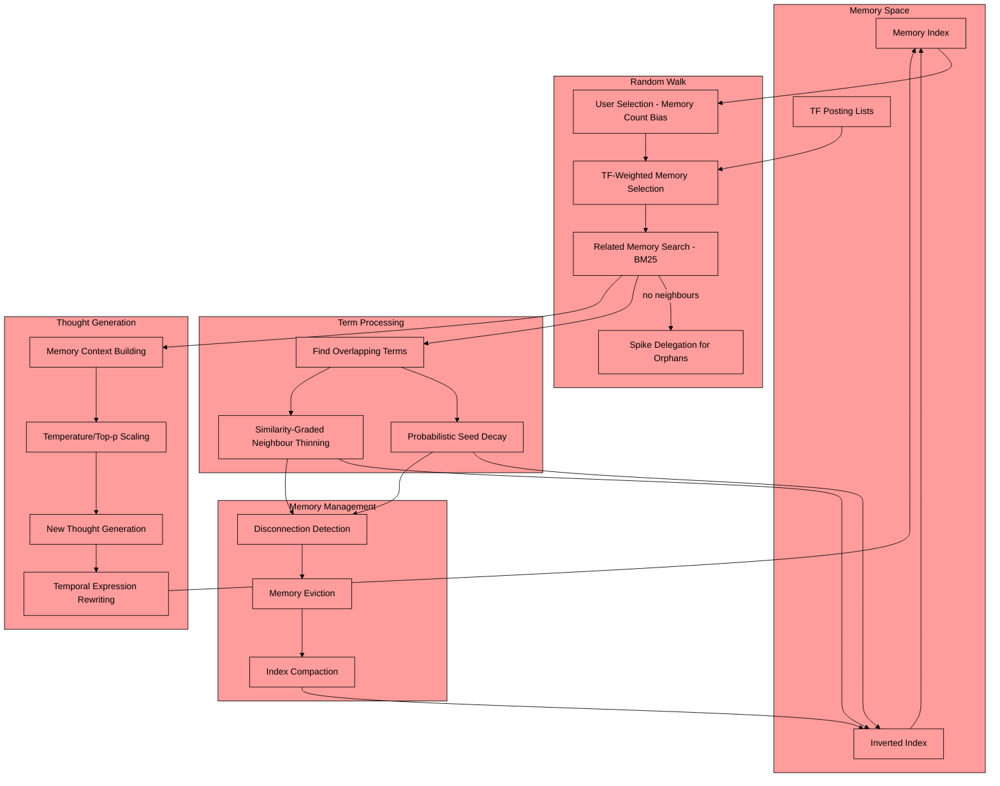

defaultMODE is a simulation of how the human mind ruminates or wanders through thoughts compressing concepts into a single thought. creating a homeostasis of new thoughts and pruned priors.

There are no separate weight tables: a memory's "weight" **is** its term frequency — the total number of times its `mid` appears across the inverted index's posting lists. Decay removes posting-list entries; eviction happens when a memory's last entry disappears.

## Core System Flow

### Background Processing Loop
- Runs every `tick_rate` seconds (default: 240s = 4 minutes)
- Continuously calls `_generate_thought()` while enabled
- Handles exceptions gracefully without crashing the loop

1. **Memory Selection with User Bias** (`_select_random_memory`)
```python
# Users with more memories are selected proportionally more often
user_weights = [len(self.memory_index.user_memories[user_id]) for user_id in user_ids]
selected_user_id = weighted_random_selection(user_ids, user_weights)

# Within the user, memory weight = total TF (posting-list appearances)
tf_totals = defaultdict(int)
for pl in self.memory_index.inverted_index.values():
    for mid in pl:
        tf_totals[mid] += 1
# Richer (higher-TF) memories are selected more often
selection_point = random.uniform(0, total_weight)
```

2. **Memory Search & Filtering**
```python
# BM25 search for top_k related memories over the inverted index
related_memories = self.memory_index.search(seed_memory, user_id=user_id, k=self.top_k)
# Filter by similarity_threshold - strict relevance filtering
related_memories = [(memory, score) for memory, score in related_memories
                   if memory != seed_memory and score >= self.similarity_threshold]
```
If no neighbours survive the threshold, the seed is an **orphan**: it is handed to
the SpikeProcessor (`spike.handle_orphaned_memory`), which may surface it in a live
channel. If the spike fires, the seed is re-queued under the agent's own user id via
`pending_seeds` so the resulting interaction memory can reconnect it on the next
cycle. Otherwise the DMN retries with a fresh seed (up to 8 attempts).

3. **Fuzzy Matching & Similarity Analysis**
```python
# Apply fuzzy matching with fuzzy_overlap_threshold
content_ratio = fuzz.token_sort_ratio(seed_memory, memory)
if content_ratio >= self.fuzzy_overlap_threshold or score >= self.combination_threshold:
    similar_memories.append((memory, max(score, content_ratio/100.0)))
# Find overlapping terms: exact set intersection, plus fuzzy term matches
# where fuzz.ratio(seed_term, term) >= fuzzy_search_threshold
```

4. **Dynamic Temperature & Top-P Scaling**
```python
# Memory density-based adaptive scaling
density = min(1.0, num_results / self.top_k)
intensity_multiplier = 1.0 - density  # Inverse relationship
new_intensity = min(100, max(0, int(100 * intensity_multiplier)))

# Sparse memories → hot and creative; dense context → cool and focused
self.temperature = 0.3 + 0.7 * (new_intensity / 100.0)   # range [0.3, 1.0]

# Banded top_p by density
top_p_value = 0.98 if density < .33 else 0.95 if density < .66 else 0.92
```
The new intensity is also written back to `runtime.amygdala_response`, so DMN
activity modulates the agent's conversational arousal.

5. **Thought Generation & Storage**
```python
# Either an LLM call...
new_thought = await self.runtime.call_api(user_content=rendered_user_content, system_prompt=system_prompt,
                                          temperature=self.temperature)
# ...or, with use_chronpression enabled, extractive chronomic compression of the
# seed + neighbours (compression ratio scales with amygdala arousal; no LLM call)
new_thought = chronomic_filter(raw_texts, compression=chron_compression)

# Saved as a new memory with temporal attribution
label = "Distillation" if self.use_chronpression else "Reflections"
thought_memory = f"{label} on priors with @{clean_name}{users_str} {timestamp}:\n{new_thought}"
self.memory_index.add_memory(user_id, thought_memory)
```
Timestamps inside memories are rewritten to natural-language temporal expressions
("earlier this evening", "last week") before entering the prompt.

6. **Probabilistic Seed Decay**
```python
# Each posting-list entry for the seed is removed with p = decay_rate.
# Expected visits to full disconnection ≈ ln(terms) / decay_rate.
# decay_rate=1.0 reproduces single-visit disconnection; lower values give gradual wear.
for term in inverted_index:
    if seed_mid in inverted_index[term] and random.random() < self.decay_rate:
        inverted_index[term].remove(seed_mid)   # tf-1, never wholesale
```

7. **Similarity-Graded Neighbour Thinning**
```python
# Close neighbours are thinned harder - their gist was just captured in the
# new thought. Distant neighbours contributed novelty, so their shared terms
# (the only bridge keeping them reachable) are thinned much more gently.
p = thin_p_min + (thin_p_max - thin_p_min) * similarity_score
for term in shared_overlapping_terms:
    if random.random() < p:
        inverted_index[term].remove(neighbour_mid)   # tf-1 per term
```

8. **Memory Management & Cleanup**
```python
def _cleanup_disconnected_memories(self):
    # Any memory with zero posting-list entries is evicted
    connected = set()
    for term_memories in self.memory_index.inverted_index.values():
        connected.update(term_memories)
    # Disconnected memories are nulled and the index compacted;
    # consistency is maintained across user_memories and inverted_index
```
Runs after every cycle (including orphan bail-outs), so fully-decayed memories
are forgotten naturally.

## Hyperparameter Effects & Mode System

### Mode Configurations
Different modes adjust multiple hyperparameters simultaneously
(presets live in `bot_config.DMNConfig.modes`):

**Conservative Mode (constructor default):**
- `combination_threshold`: 0.8 (high — strict memory combination)
- `similarity_threshold`: 0.4 (high — strict relevance filtering)
- `decay_rate`: 0.15 (low — seeds wear slowly)
- `top_k`: 8 (low — few memories considered)
- `fuzzy_overlap_threshold` / `fuzzy_search_threshold`: 90 / 95
- `thin_p_min` / `thin_p_max`: 0.02 / 0.4 (gentle neighbour thinning)

**Homeostatic Mode:**
- `combination_threshold`: 0.3 (medium)
- `similarity_threshold`: 0.3 (medium)
- `decay_rate`: 0.25 (medium)
- `top_k`: 16 (medium)
- `fuzzy_overlap_threshold` / `fuzzy_search_threshold`: 80 / 90
- `thin_p_min` / `thin_p_max`: 0.05 / 0.6

**Forgetful Mode:**
- `combination_threshold`: 0.02 (very low — loose memory combination)
- `similarity_threshold`: 0.2 (low — accepts less relevant memories)
- `decay_rate`: 0.5 (high — rapid seed wear)
- `top_k`: 24 (high — considers many memories)
- `fuzzy_overlap_threshold` / `fuzzy_search_threshold`: 70 / 80
- `thin_p_min` / `thin_p_max`: 0.1 / 0.8 (aggressive neighbour thinning)

### Adaptive Feedback Loop
The system creates a **self-regulating feedback loop**:
1. **Memory density** → **temperature scaling** → **response creativity**
2. **Term overlap** → **probabilistic TF decay** → **memory selection bias**
3. **User memory counts** → **selection probability** → **thought generation focus**
4. **Fuzzy matching** → **index thinning** → **search efficiency**
5. **Orphaned seeds** → **spike surfacing** → **reconnection through live interaction**

The system acts like a self-organizing network where:
- **User bias** drives attention toward active participants
- **Memory density** controls creative vs. focused responses
- **Term relationships** drive growth and pruning
- **Memory TF** evolves naturally through use and decay
- **Disconnected memories** are cleaned up automatically
- **New thoughts** create new connections and associations
- **Temporal awareness** maintains context across time
- **Adaptive scaling** balances exploration vs. exploitation

The network literally grows and shrinks based on interaction patterns, term relationships, and memory density, implementing an artificial **stream of consciousness** that becomes more creative when few memories are available and more focused when rich context exists.

---

1. **Search Evolution Through Thinning**
```python
# Original memory has terms A, B, C, D
# Related memory has terms A, B, C, E
# After a few cycles of probabilistic thinning:
# Original memory keeps A, B, C, D (worn gradually by seed decay)
# Related memory tends toward E (shared A, B, C entries thinned away)
```
So when you later search, this memory is now more strongly associated with 'E' rather than the common terms! This creates:
- More distinct memory signatures
- Reduced "noise" from common terms
- Emergent specialization of memories

2. **TF-Based Association Shifts**
```python
# A memory's influence is its posting-list footprint.
# Seed decay:      p(entry removed) = decay_rate
# Neighbour thin:  p(entry removed) = thin_p_min + (thin_p_max - thin_p_min) * similarity
```
This means:
- Memories that lose many term entries become less influential and less likely to be reselected as seeds
- Remaining unique terms become proportionally more important
- Search results favor memories with strong unique associations
- A memory whose last entry disappears is evicted — forgetting is structural, not scheduled

3. **Emergent Novelty Through Term Distribution**
- As common terms get thinned across multiple memories
- Unique term combinations become more significant
- Search results naturally surface more novel connections
- The system "learns" to recognize unique patterns

4. **Dynamic Search Space**
The inverted index becomes:
```
Before thinning:
term_A -> [mem1, mem2, mem3, mem4]
term_B -> [mem1, mem2, mem3]
term_C -> [mem1, mem4]

After thinning:
term_A -> [mem1]  # Now unique to mem1
term_B -> [mem2]  # Now unique to mem2
term_C -> [mem1, mem4]  # Still shared but less common
```

1. Search finds related memories
2. Thinning makes memories more distinct
3. Future searches find different associations
4. The network organically develops novel pathways
5. Search results become more creative/unexpected

---

## Emergent Social Network


1. **Maintain Individual Identity**
- Each agent has its own memory space and thinning patterns
- Natural preference emergence through term-frequency weighting
- Prevents mode collapse through individual memory differentiation

2. **Social Memory Architecture**
```python
# Each agent maintains its own:
self.memory_index = memory_index     # Personal experiences (TF lives in its inverted index)
self.amygdala_response = 50          # Unique arousal state
self.runtime = runtime               # Platform-agnostic host (Discord bot, TUI, ...)
```

3. **Inter-Agent Learning**
- Agents learn about each other through interactions
- Memory thinning creates unique perspectives on shared experiences
- @ mentions show emergent understanding of other agents' specialties

4. **Autonomous Social Dynamics**
```python
# When agent B appears in agent A's memory
memory_users = set()
for memory, _ in related_memories:
    resolved = await self.runtime.resolve_user(memory_user_id)
    if resolved != user_name:
        memory_users.add(resolved)
```

They can maintain coherent identities and relationships while still operating autonomously.

- Natural role emergence
- Knowledge specialization
- Social group formation
- Complex inter-agent relationships
