```mermaid
%%{
  init: {
    'theme': 'base',
    'themeVariables': {
      'primaryColor': '#ff9c9c',
      'primaryTextColor': '#000000',
      'primaryBorderColor': '#000000',
      'lineColor': '#000000',
      'secondaryColor': '#ff9c9c',
      'tertiaryColor': '#ff9c9c',
      'backgroundColor': '#ff9c9c',
      'background': '#ff9c9c',
      'nodeBorder': '#000000',
      'textColor': '#000000',
      'mainBkg': '#ff9c9c',
      'edgeLabelBackground': '#ff9c9c',
      'clusterBkg': '#ff9c9c',
      'clusterBorder': '#000000',
      'titleColor': '#000000',
      'fontFamily': 'Courier New, Courier, monospace',
      'noteBackgroundColor': '#ff9c9c',
      'noteBorderColor': '#000000'
    }
  }
}%%

graph LR
    subgraph Environment["Environment"]
        DM[Direct Messages] & MC[Channel Messages] & FI[Files] -->|Input Event| AT[Attention]
    end

    subgraph Processing["Core Processing"]
        AT -->|Parse| CP[Context Processing]
        CP -->|Build Initial Context| WC[Working Context]

        subgraph HPC["Hippocampal Formation"]
            WC -->|Query| MI[Memory Index]
            MI -->|Lookup| II[Inverted Index]
            II -->|Retrieve and Score| CM[Candidate Memories]
            CM -->|Rerank| RM[Relevant Memories]
        end

        subgraph AMG["Amygdala Complex"]
            RM -->|Memory Density| MD[Memory Density]
            MD -->|Arousal Level| AR[Arousal Response]
            AR -->|Set Temp| TC[Temperature Control]
        end

        subgraph TI["Temporal Integration"]
            WC & RM -->|Extract Time| TP[Temporal Parser]
            TP -->|Format| TCC[Time Context]
            TCC -->|Enrich| EWC[Enriched Working Context]
        end

        EWC & TC -->|Prompt| PC[Prompt Construction]
    end

    subgraph DMN["Default Mode Network"]
        direction TB
        MI2[Memory Index] -->|Random Walk| RW[Random Walk]
        RW -->|Select| SM[Seed Memory]
        SM -->|Retrieve| RM2[Related Memories]
        RM2 -->|Overlap Analysis| TO[Term Overlap]
        TO -->|Prune| PR[Term Pruning]
        PR -->|Update Weights| UW[Update Weights]
        UW --> MI2
        RM2 --> DMN_WC
        PR --> DMN_WC
        DMN_WC[Prompt Context] -->|Thought Gen| TG[Thought Generation]
        TG -->|New Memory| NM[New Memory]
        NM -->|Store| MI2
    end

    subgraph Response["LLM and Output"]
        PC -->|LLM Call| LLM[Language Model]
        LLM -->|Generate| RG[Response]
        RG -->|Output| DR[Platform Adapter Response]
    end

    DR -.->|Store Interaction| MI
    AR -.->|Modulate| RG
    MD -.->|Update| AR
    UW -.->|Sync| MI

    class DM,MC,FI,AT env
    class CP,WC,PC,EWC process
    class MI,II,CM,RM,HPC hpc
    class MD,AR,TC,AMG amg
    class RW,SM,RM2,TO,PR,UW,DMN_WC,TG,NM,MI2 dmn
    class TP,TCC TI
    class LLM,RG,DR response

```

Input and output flow through the active `PlatformAdapter` (Discord, TUI, ...), so the same
pipeline runs on any platform — see `docs/HOOKS.md` for the adapter/runtime contracts.
The core pipeline lives in `agent/agent_core.py` (`process_message` / `process_files`).